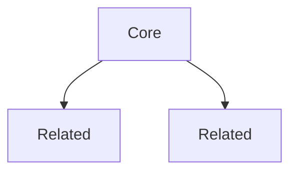

# KG Node Templates

---

## Concept Node

```markdown
---
up: ["[[Parent Map]]"]
related: ["[[Related Concept]]"]
created: {{date}}
type: concept
tags: [options, concept-domain]
aliases: [Alternative Name]
---

# {{Concept Name}}

> [!info] Definition
> Clear, concise definition of the concept. ^definition

## Overview

Expanded explanation. What it is, why it matters, how it works.

## Key Properties

1. **Property 1:** Description
2. **Property 2:** Description

## Formula

$$
formula here
$$

## In Practice

How this concept manifests in real trading. Link to strategies that use it:
- [[strategy-1]] uses this for...
- [[strategy-2]] depends on this when...

## Common Misconceptions

> [!warning] Watch Out
> What people often get wrong about this concept.

---
**See also:** [[Related Concept 1]] | [[Related Concept 2]]
```

---

## Strategy Node

```markdown
---
up: ["[[Options Strategies]]"]
related: ["[[Related Strategy]]"]
created: {{date}}
type: strategy
category: options
subcategory: income | directional | volatility | hedging | systematic
complexity: simple | medium | advanced
data_source: [yfinance]
tags: [options, strategy-tags]
---

# {{Strategy Name}}

> [!abstract]
> One-line description: what it does and when to use it.

## Core Mechanic

What you do, why it works, ASCII P&L diagram.

```
P&L diagram here
```

## Greeks Profile

| Greek | Exposure | Meaning |
|-------|----------|---------|
| [[Delta]] | ... | ... |
| [[Gamma]] | ... | ... |
| [[Theta]] | ... | ... |
| [[Vega]] | ... | ... |

## When It Works

- Market conditions
- [[IV Rank]] thresholds
- Regime fit

## Trade Construction

Step-by-step entry with concrete parameters (DTE, delta, width).

| Parameter | Value |
|-----------|-------|
| DTE | ... |
| Delta | ... |
| Target exit | ... |

### Screener Criteria

| Filter | Threshold |
|--------|-----------|
| ... | ... |

## Risk Management

- Max loss scenario
- Stop/adjustment rules
- Position sizing guidance

> [!danger] Key Risk
> Primary risk and what triggers it.

## Data Pipeline

> [!info] Synesis Data
> | Need | Source | Method |
> |------|--------|--------|
> | ... | yfinance | `get_options_chain()` |

---
**Related strategies:** [[Strategy 1]] | [[Strategy 2]]
**Concepts:** [[Concept 1]] | [[Concept 2]]
**Regimes:** [[Regime 1]] | [[Regime 2]]
```

---

## Source Node

```markdown
---
up: ["[[Sources Map]]"]
related: []
created: {{date}}
type: source
raw_file: "raw/filename.pdf"
authors: ["Author Name"]
year: 2025
tags: [source, domain]
---

# Source: {{Title}}

> [!info] Citation
> Authors (Year). *Title*. Publisher/Source.

> [!abstract] Key Takeaways
> 1. Finding 1
> 2. Finding 2
> 3. Finding 3

## Summary

What this source covers and its main argument.

## Extracted Concepts

- [[Concept 1]] — how this source informs it
- [[Concept 2]] — what it adds

## Extracted Strategies

- [[Strategy 1]] — connection
- [[Strategy 2]] — connection

## Key Data Points

Notable figures, tables, or statistics worth referencing.

## Limitations

What the source doesn't cover or gets wrong.

---
**See also:** [[Related Source]] | [[Related Map]]
```

---

## Map Node (MOC)

```markdown
---
up: ["[[Home]]"]
related: []
created: {{date}}
type: map
tags: [map, domain]
---

# {{Topic}} Map

> [!abstract] Overview
> What this map covers and why it matters.

## Core Nodes

- [[Node 1]] — brief description
- [[Node 2]] — brief description

## By Category

### Subcategory A
- [[Node]] — description

### Subcategory B
- [[Node]] — description

## How They Connect



## Decision Guide

When to use what — flowchart or table.

---
Back to [[Home]]
```
