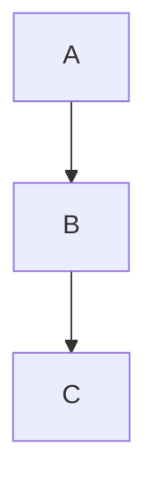

# Obsidian Syntax Quick Reference

Compact cheat sheet for Obsidian-specific markdown syntax.

---

## Links & Embeds

| Syntax | Result |
|--------|--------|
| `[[Note]]` | Internal link |
| `[[Note\|Alias]]` | Link with display text |
| `[[Note#Heading]]` | Link to heading |
| `[[Note#^block-id]]` | Link to block |
| `![[Note]]` | Embed entire note |
| `![[Note#Heading]]` | Embed section |
| `![[Note#^block-id]]` | Embed block |
| `![[image.png]]` | Embed image |
| `![[image.png\|300]]` | Image with width |
| `![[image.png\|300x200]]` | Image with dimensions |
| `![[file.pdf]]` | Embed PDF |
| `![[audio.mp3]]` | Embed audio |

---

## Block References

```markdown
Paragraph to reference. ^my-id

[[Note#^my-id]]      # Link to block
![[Note#^my-id]]     # Embed block
```

Block ID rules: letters, numbers, hyphens only.

---

## Text Formatting

| Syntax | Result |
|--------|--------|
| `**bold**` | **bold** |
| `*italic*` | *italic* |
| `***both***` | ***both*** |
| `~~strike~~` | ~~strike~~ |
| `==highlight==` | ==highlight== |
| `` `code` `` | `code` |
| `%%comment%%` | Hidden in preview |

---

## Callouts

```markdown
> [!type] Optional Title
> Content here
```

**Foldable:**
- `> [!note]-` Collapsed by default
- `> [!note]+` Expanded by default

**Types:** note, abstract, info, tip, success, question, warning, failure, danger, bug, example, quote

**Aliases:**
- abstract: summary, tldr
- info: todo
- tip: hint, important
- success: check, done
- question: help, faq
- warning: caution, attention
- failure: fail, missing
- danger: error
- quote: cite

---

## Frontmatter (LYT Properties)

```yaml
---
up: ["[[Parent Note]]"]      # Hierarchy
related: ["[[Related]]"]     # Connections
in: ["[[Maps]]"]             # Collections
created: 2025-12-14
tags: [tag1, tag2]
aliases: [Alias 1]
status: draft
type: research | moc | statement | effort
rank: 5                      # Priority (efforts)
---
```

| Property | Purpose |
|----------|---------|
| `up` | Parent/hierarchy |
| `related` | Related notes |
| `in` | Collection membership |
| `created` | Creation date |
| `rank` | Priority (1-10) |

---

## Tags

```markdown
#tag
#nested/tag
#kebab-case-tag
```

---

## Tasks

```markdown
- [ ] Unchecked
- [x] Completed
- [/] In progress
- [-] Cancelled
```

---

## Code Blocks

````markdown
```language
code here
```
````

Common languages: python, javascript, typescript, sql, json, yaml, bash, markdown

---

## Math (LaTeX)

```markdown
Inline: $E = mc^2$

Block:
$$
\sum_{i=1}^{n} x_i
$$
```

---

## Tables

```markdown
| Left | Center | Right |
|:-----|:------:|------:|
| L    |   C    |     R |
```

---

## Mermaid Diagrams

````markdown

````

Types: graph, flowchart, sequenceDiagram, classDiagram, stateDiagram, gantt, pie, timeline

---

## Headings

```markdown
# H1 - Title only
## H2 - Sections
### H3 - Subsections
#### H4+
```

---

## Lists

```markdown
- Bullet
  - Nested

1. Numbered
   1. Nested
```

---

## Footnotes

```markdown
Text[^1] with footnote.

[^1]: Footnote content.
```

---

## Horizontal Rule

```markdown
---
```

---

## External Links

```markdown
[Text](https://url.com)
[Text](https://url.com "Title")

```

---

## Comments

```markdown
%% Block comment
Multiple lines
Hidden in preview %%

Inline: %%hidden%% visible
```

---

## Keyboard Shortcuts

| Action | Win/Linux | Mac |
|--------|-----------|-----|
| Bold | Ctrl+B | Cmd+B |
| Italic | Ctrl+I | Cmd+I |
| Link | Ctrl+K | Cmd+K |
| Code | Ctrl+E | Cmd+E |
| Checkbox | Ctrl+Enter | Cmd+Enter |
| Quick switch | Ctrl+O | Cmd+O |
| Commands | Ctrl+P | Cmd+P |
| Search all | Ctrl+Shift+F | Cmd+Shift+F |
| Graph | Ctrl+G | Cmd+G |
| Split | Ctrl+\ | Cmd+\ |
| Close pane | Ctrl+W | Cmd+W |
| New note | Ctrl+N | Cmd+N |
| Open settings | Ctrl+, | Cmd+, |

---

## Dataview (Plugin)

**List:**
```dataview
LIST FROM "Atlas/Maps"
SORT file.name asc
```

**Table:**
```dataview
TABLE created, status
FROM #research
WHERE status != "complete"
SORT created desc
```

**Efforts by rank:**
```dataview
TABLE WITHOUT ID
  file.link as "Effort",
  rank as "Priority"
FROM "Efforts/On"
SORT rank desc
```

**Unrequited notes (linking here, not linked back):**
```dataview
LIST FROM [[]]
AND !outgoing([[]])
```

**Inline:** `= this.file.mtime`

---

## Templater (Plugin)

```markdown
<% tp.date.now("YYYY-MM-DD") %>
<% tp.file.title %>
<% tp.file.cursor() %>
```

---

## ACE Folder Structure

```
Vault/
├── Atlas/          # Knowledge
│   ├── Maps/       # MOCs (index notes)
│   └── Dots/       # Atomic notes
├── Calendar/       # Time-based
│   └── Notes/      # Daily notes
├── Efforts/        # Projects
│   ├── On/         # Active
│   ├── Ongoing/    # Recurring
│   ├── Simmering/  # Background
│   └── Sleeping/   # Paused
├── +/              # Inbox
└── x/              # Extras (templates, images)
```

---

## Note Types

| Type | Title Convention | Example |
|------|------------------|---------|
| MOC | Topic Map | "Habits Map" |
| Statement | Full sentence | "Small wins foster control" |
| Effort | Project name | "Build Trading Bot" |
| Source | "Source: Title" | "Source: Atomic Habits" |
| Daily | Date | "2025-12-14" |
