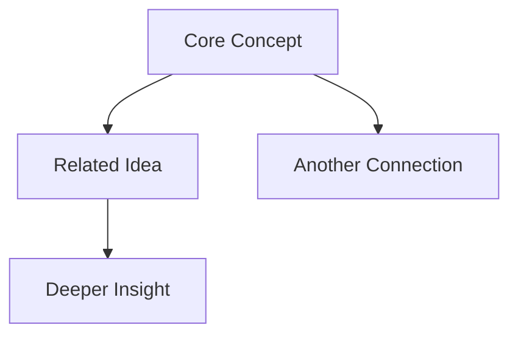
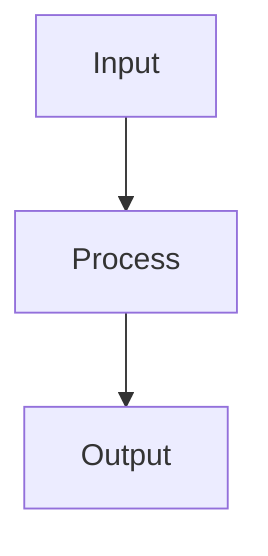

# Note Templates for Research

Ready-to-use templates with LYT (Linking Your Thinking) framework properties.

---

## Home Note Template

```markdown
---
created: {{date}}
---

Your launchpad and home base.

> [!Map]- # Atlas
> *Where would you like to go?*
>
> - [[Library]] | [[Sources]] | [[Concepts]]
> - [[Research Map]] | [[Projects Map]]

> [!Calendar]- # Calendar
> *What's on your mind?*
>
> - Today's note: [[{{date}}]]
> - [[Plan and Review]]

> [!Box]- # Efforts
> *What can you work on?*
>
> For a concentrated view, go to [[Efforts]].
>
> > [!Box]+ ### 🔥 On
> > ```dataview
> > TABLE WITHOUT ID file.link as "", rank as "Rank"
> > FROM "Efforts/On"
> > SORT rank desc
> > ```
>
> > [!Box]+ ### ♻️ Ongoing
> > ```dataview
> > TABLE WITHOUT ID file.link as "", rank as "Rank"
> > FROM "Efforts/Ongoing"
> > SORT rank desc
> > ```
```

---

## Map of Content (MOC) Template

```markdown
---
up:
  - "[[Home]]"
related: []
created: {{date}}
in:
  - "[[Maps]]"
type: moc
---

# {{topic}} Map

> [!abstract] Overview
> Brief description of what this map covers and why it matters.

## Core Concepts

- [[Concept 1]] - Brief description
- [[Concept 2]] - Brief description
- [[Concept 3]] - Brief description

## Key Insights

- [[Insight expressed as full sentence]]
- [[Another insight as statement]]

## How They Connect

Describe how these concepts relate to each other...



## Related Areas

- [[Related MOC 1]]
- [[Related MOC 2]]

## Resources

- [[Source 1]]
- [External Resource](url)

---

> [!tip]+ Unrequited Notes
> Notes linking here but not linked back:
> ```dataview
> LIST FROM [[]] AND !outgoing([[]])
> SORT file.name asc
> ```

---
Back to [[Home]]
```

---

## Statement Note (Atomic/Evergreen) Template

```markdown
---
up:
  - "[[Parent MOC]]"
related:
  - "[[Related Statement]]"
created: {{date}}
type: statement
---

Main content explaining this single idea. Keep it focused and atomic.

This concept connects to [[Another Idea]] because...

> [!note]- Supporting Evidence
> - Evidence or quote 1
> - Evidence or quote 2
> - Reference to [[Source]]

The implications of this are significant for [[Application Area]].

---
See also: [[Related Concept 1]], [[Related Concept 2]]
```

---

## Effort Template

```markdown
---
up:
  - "[[Efforts]]"
related: []
created: {{date}}
rank: 5
status: on | ongoing | simmering | sleeping
type: effort
---

# {{effort_name}}

> [!abstract] Goal
> What does success look like for this effort?

## Context

Why is this effort important? What's the background?

## Current Status

> [!info] Status: {{status}}
> Brief update on where things stand.

## Key Tasks

- [ ] Task 1
- [ ] Task 2
- [ ] Task 3

## Notes & Progress

### {{date}}

Progress notes...

## Resources

- [[Related Note]]
- [External Resource](url)

## Related Efforts

- [[Related Effort 1]]
- [[Related Effort 2]]

---
Back to [[Efforts]]
```

---

## Research Report Template

```markdown
---
up:
  - "[[Research Map]]"
related: []
created: {{date}}
in:
  - "[[Sources]]"
tags:
  - research
  - {{topic}}
status: in-progress
type: research
---

# {{title}}

> [!abstract] TL;DR
> 2-3 sentence summary of key findings and recommendations.

## Research Question

What problem are we trying to solve? What decision will this inform?

## Key Findings

### Finding 1: {{finding_title}}

Details of the finding with supporting evidence.

> [!tip] Actionable Insight
> What to do with this finding.

**Evidence:**
- Source 1
- Source 2

### Finding 2: {{finding_title}}

Details...

## Methodology

How was this research conducted?

- **Search Strategy:** Keywords and sources used
- **Evaluation Criteria:** How sources were assessed
- **Limitations:** What wasn't covered

## Comparative Analysis

| Approach | Pros | Cons | Best For |
|----------|------|------|----------|
| A | ... | ... | ... |
| B | ... | ... | ... |

## Recommendations

### Do This
1. Primary recommendation with rationale

### Avoid This
1. Anti-pattern to avoid with explanation

## Implementation Notes

> [!example] Code Example
> ```python
> # Example implementation
> ```

## Open Questions

- [ ] Question that needs further investigation
- [ ] Another open question

## Sources

1. [Source Title](url) - Brief description
2. [[Internal Note]] - What it covers

## Related Notes

- [[Related Topic 1]]
- [[Related Topic 2]]

---
*Last updated: {{date}}*
```

---

## Strategy Research Template

```markdown
---
title: "Strategy: {{strategy_name}}"
date: {{date}}
tags:
  - strategy
  - research
  - trading
status: research
type: strategy
asset_class:
timeframe:
---

# Strategy: {{strategy_name}}

> [!abstract] Summary
> Brief description of the strategy and expected performance.

## Strategy Overview

**Type:** Momentum / Mean Reversion / Statistical Arbitrage / etc.
**Timeframe:** HFT / Intraday / Swing / Position
**Asset Class:** Equities / Futures / Crypto / etc.
**Complexity:** Low / Medium / High

## Core Hypothesis

> [!question] Hypothesis
> What market inefficiency does this exploit?
> - **Expected Effect:** Direction and magnitude
> - **Why It Works:** Economic reasoning
> - **When It Fails:** Market conditions that break it

## Signal Generation

### Primary Signals
1. Signal 1: Description
2. Signal 2: Description

### Entry Rules
- Condition 1
- Condition 2

### Exit Rules
- Condition 1
- Condition 2

## Risk Management

| Parameter | Value | Rationale |
|-----------|-------|-----------|
| Position Size | % | Why |
| Stop Loss | % | Why |
| Max Drawdown | % | Why |
| Concentration | % | Why |

## Backtesting Results

> [!warning] Backtest Caveats
> - Period tested:
> - Look-ahead bias check:
> - Transaction costs included:
> - Survivorship bias addressed:

### Performance Metrics

| Metric | Value |
|--------|-------|
| CAGR | % |
| Sharpe Ratio | |
| Max Drawdown | % |
| Win Rate | % |
| Profit Factor | |

## Failure Modes

> [!danger] Known Risks
> 1. Risk 1: Description and mitigation
> 2. Risk 2: Description and mitigation

## Implementation

### Data Requirements
- Data source 1
- Data source 2

### Code Reference
```python
# Key implementation logic
```

### Dependencies
- Library 1
- Library 2

## Literature

- [[Paper 1]] - Key finding
- [External Paper](url) - Key finding

## Next Steps

- [ ] Task 1
- [ ] Task 2

## Related Strategies

- [[Similar Strategy 1]]
- [[Similar Strategy 2]]
```

---

## Paper/Article Notes Template

```markdown
---
title: "Paper: {{paper_title}}"
date: {{date}}
tags:
  - paper
  - {{topic}}
authors: []
year:
source:
url:
status: reading | summarized | applied
rating: 1-5
---

# Paper: {{paper_title}}

> [!info] Citation
> Authors (Year). Title. Source. [Link](url)

## Key Takeaways

> [!abstract] TL;DR
> 1. Main finding 1
> 2. Main finding 2
> 3. Main finding 3

## Summary

### Problem Addressed
What problem does this paper solve?

### Methodology
How did they approach it?

### Key Results
What did they find?

| Finding | Metric | Value |
|---------|--------|-------|
| ... | ... | ... |

### Contributions
What's novel about this work?

## Critical Analysis

> [!question] Strengths
> - Strength 1
> - Strength 2

> [!warning] Limitations
> - Limitation 1
> - Limitation 2

> [!tip] Practical Applications
> - How to use this in practice

## Quotes

> "Important quote from the paper" (p. X)

## Connections

### Related Papers
- [[Related Paper 1]]
- [[Related Paper 2]]

### Related Concepts
- [[Concept 1]]
- [[Concept 2]]

## Implementation Ideas

- [ ] Idea 1 to try
- [ ] Idea 2 to try

## Notes

Additional thoughts and observations...
```

---

## Daily Research Log Template

```markdown
---
title: Research Log - {{date}}
date: {{date}}
tags:
  - log
  - daily
type: log
---

# Research Log - {{date}}

## Focus Areas Today

- [ ] Focus 1
- [ ] Focus 2

## Progress

### {{Topic 1}}

**What I learned:**
- Point 1
- Point 2

**Key resources:**
- [[Note 1]]
- [Article](url)

**Questions raised:**
- Question 1?

### {{Topic 2}}

...

## Insights

> [!tip] Key Insight
> Description of insight and implications

## Blockers

> [!warning] Blocked On
> - Blocker 1: What's needed to resolve

## Tomorrow

- [ ] Priority 1
- [ ] Priority 2

## Links Created Today

- [[New Note 1]]
- [[New Note 2]]
```

---

## Concept/Definition Template

```markdown
---
title: {{concept}}
date: {{date}}
tags:
  - concept
  - {{domain}}
aliases:
  - {{alternative_name}}
type: concept
---

# {{concept}}

> [!info] Definition
> Clear, concise definition of the concept. ^definition

## Overview

Expanded explanation of the concept.

## Key Properties

1. **Property 1:** Description
2. **Property 2:** Description

## Examples

> [!example] Example 1
> Concrete example demonstrating the concept

## Mathematical Formulation

$$
formula
$$

## Related Concepts

- [[Related Concept 1]] - Relationship
- [[Related Concept 2]] - Relationship

## Applications

- Application 1
- Application 2

## Common Misconceptions

> [!warning] Common Mistake
> What people often get wrong

## Sources

- [[Source Note]]
- [External Source](url)
```

---

## Meeting/Discussion Notes Template

```markdown
---
title: "Meeting: {{topic}}"
date: {{date}}
tags:
  - meeting
  - {{project}}
attendees: []
type: meeting
---

# Meeting: {{topic}}

**Date:** {{date}}
**Attendees:** Person 1, Person 2

## Agenda

1. Topic 1
2. Topic 2

## Discussion

### Topic 1

Key points discussed:
- Point 1
- Point 2

**Decision:** What was decided

### Topic 2

...

## Action Items

- [ ] @Person1 - Task by Date
- [ ] @Person2 - Task by Date

## Follow-up

- Next meeting:
- Open questions:

## Related

- [[Project Note]]
- [[Previous Meeting]]
```

---

## Implementation/Code Notes Template

```markdown
---
title: "Implementation: {{feature}}"
date: {{date}}
tags:
  - implementation
  - code
  - {{project}}
status: planned | in-progress | complete | deprecated
type: implementation
---

# Implementation: {{feature}}

> [!abstract] Purpose
> What this implementation does and why.

## Requirements

- [ ] Requirement 1
- [ ] Requirement 2

## Design

### Architecture



### Key Components

1. **Component 1:** Purpose
2. **Component 2:** Purpose

## Implementation

### Core Logic

```python
# Key implementation
def main_function():
    pass
```

### Configuration

```yaml
config:
  key: value
```

## Usage

```python
# How to use
```

## Testing

- [ ] Test case 1
- [ ] Test case 2

## Known Issues

> [!bug] Issue 1
> Description and workaround

## Performance

| Metric | Value |
|--------|-------|
| Speed | X ms |
| Memory | X MB |

## Related

- [[Design Doc]]
- [[API Reference]]

## Changelog

- {{date}}: Initial implementation
```

---

## Quick Capture Template

```markdown
---
date: {{date}}
tags: [inbox]
type: capture
---

# Quick Note

{{content}}

---

- [ ] Process this note
- [ ] Link to relevant notes
- [ ] Add to appropriate project
```
