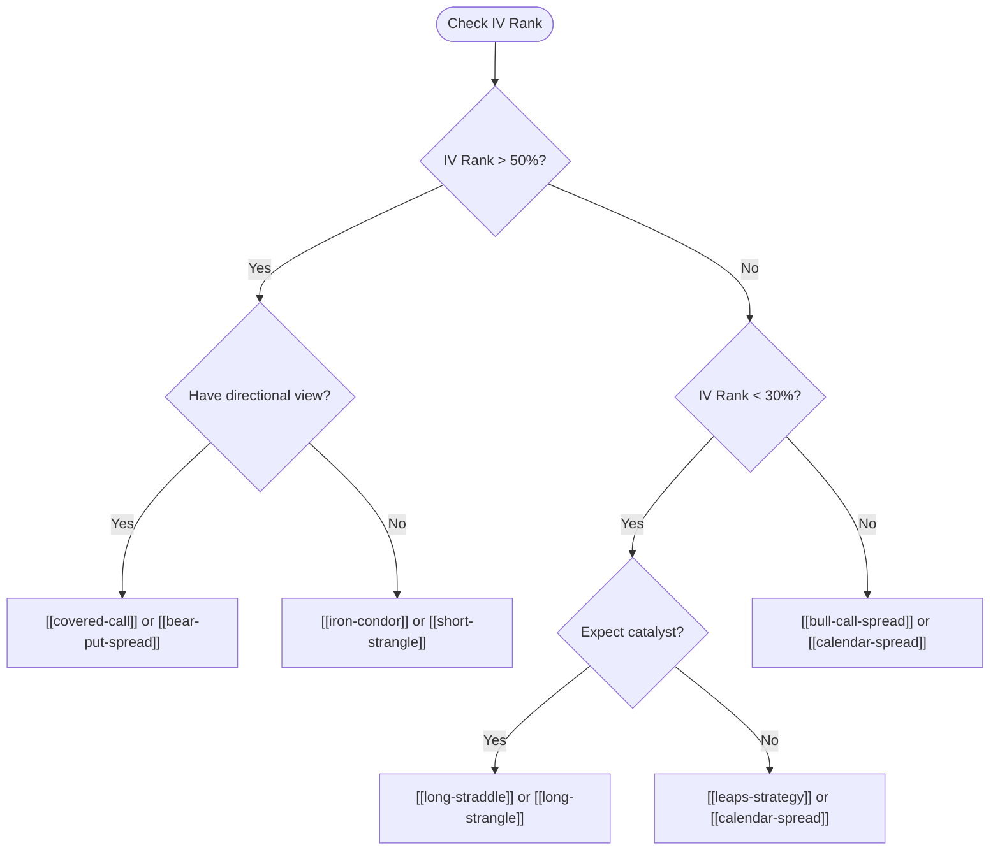

# IV Rank Strategy Selection

> [!abstract]
> Systematic framework: [[iv-rank]] determines which strategy to deploy. High IV = sell premium. Low IV = buy premium. Removes emotion from strategy selection.

## Core Framework

The single most important decision in options trading: **are options cheap or expensive right now?** [[iv-rank]] answers this objectively.

## The Matrix

| [[iv-rank]] | Premium | Strategies | Rationale |
|-------------|---------|------------|-----------|
| **> 70%** | Very rich | [[short-strangle]], [[iron-condor]] | Sell aggressively; IV mean-reversion edge is strong |
| **50-70%** | Rich | [[iron-condor]], [[covered-call]], [[iron-butterfly]] | Sell premium with defined risk |
| **30-50%** | Fair | [[bull-call-spread]], [[bear-put-spread]], [[calendar-spread]] | Directional spreads; neither buying nor selling has strong edge |
| **< 30%** | Cheap | [[long-straddle]], [[long-strangle]], [[leaps-strategy]] | Buy premium; IV likely to expand |
| **< 15%** | Very cheap | [[long-straddle]], [[calendar-spread]] | Aggressive long vol; historically rare, strong edge |

## Decision Flowchart



## Implementation Rules

1. **Check IV Rank first** — before any other analysis
2. **Never sell premium when IV Rank < 30%** — you're selling cheap insurance
3. **Never buy premium when IV Rank > 70%** — you're buying expensive insurance
4. **Mid-range (30-50%) is flexible** — use directional analysis to decide
5. **Combine with [[regime-options-matrix]]** for regime context

## Computing IV Rank

**From VIX (index strategies):**
```
VIX_rank = (VIX_current - VIX_52w_low) / (VIX_52w_high - VIX_52w_low)
```

**From chain IV (single stocks):**
```
ATM_IV = average IV of nearest ATM call + put
IV_rank = (ATM_IV - min_52w) / (max_52w - min_52w)
```

## Data Pipeline

> [!info] Synesis Data
> | Need | Source | Method |
> |------|--------|--------|
> | Current VIX | yfinance | `get_quote("^VIX")` |
> | VIX 52-week range | yfinance | `get_history("^VIX", period="1y")` |
> | ATM IV per stock | yfinance | `get_options_chain(ticker, exp)` → ATM IV |
> | Historical IV (approx) | yfinance | Track chain IV over time |

---
**Related strategies:** [[regime-options-matrix]] | [[volatility-risk-premium]] | [[iron-condor]] | [[long-straddle]]
**Concepts:** [[iv-rank]] | [[implied-volatility]] | [[vega]] | [[theta]]
