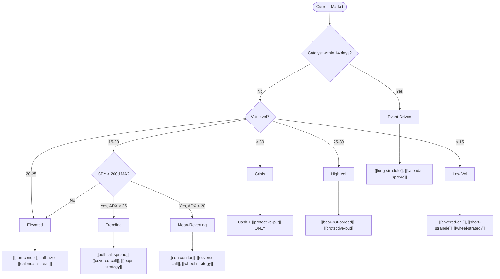

# Regime-Options Matrix

> [!abstract]
> Map the current market regime (VIX level, trend, catalysts) to the optimal options strategy. Combines with [[iv-rank-strategy-selection]] for a complete systematic framework.

## Regime Classification

| Regime | VIX | SPY vs 200d MA | ADX | Catalyst? |
|--------|-----|---------------|-----|-----------|
| **Low Volatility** | < 15 | Above | — | No |
| **Trending Bull** | 15-20 | Above | > 25 | No |
| **Mean-Reverting** | 15-20 | Near | < 20 | No |
| **Elevated** | 20-25 | — | — | — |
| **High Volatility** | 25-30 | Below | — | — |
| **Crisis** | > 30 | Below | — | Systemic |
| **Event-Driven** | Any | Any | Any | Yes (< 14d) |

## The Matrix

## Strategy-Regime Table

| Strategy | Low Vol | Trending | Mean-Rev | Elevated | High Vol | Crisis | Event |
|----------|---------|----------|----------|----------|----------|--------|-------|
| [[covered-call]] | ++ | + | ++ | - | -- | -- | - |
| [[iron-condor]] | ++ | - | ++ | + | -- | -- | - |
| [[short-strangle]] | ++ | - | + | - | -- | -- | - |
| [[wheel-strategy]] | ++ | + | ++ | - | -- | -- | - |
| [[bull-call-spread]] | + | ++ | - | + | - | -- | - |
| [[bear-put-spread]] | - | - | - | + | ++ | + | - |
| [[long-straddle]] | - | - | - | + | + | + | ++ |
| [[calendar-spread]] | + | - | + | + | - | - | ++ |
| [[protective-put]] | - | - | - | + | ++ | ++ | + |

`++` = ideal, `+` = acceptable, `-` = avoid, `--` = never

## VIX Position Sizing Override

Always apply on top of regime strategy selection:

| VIX | Position Size |
|-----|-------------|
| < 15 | 100% |
| 15-20 | 80% |
| 20-25 | 60% |
| 25-30 | 40% |
| > 30 | 20% (crisis only) |

## Data Pipeline

> [!info] Synesis Data
> | Need | Source | Method |
> |------|--------|--------|
> | VIX | yfinance | `get_quote("^VIX")` |
> | SPY price + 200d MA | yfinance | `get_history("SPY", period="1y")` |
> | ADX | Compute | From SPY price history (14-period) |
> | [[iv-rank]] | yfinance | VIX 52-week range |

---
**Related strategies:** [[iv-rank-strategy-selection]] | [[volatility-risk-premium]]
**Concepts:** [[implied-volatility]] | [[realized-volatility]] | [[iv-rank]]
