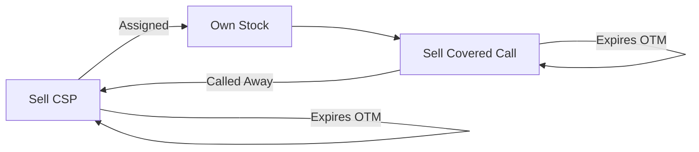

# Wheel Strategy

> [!abstract]
> Repeating cycle: sell cash-secured puts → get assigned → sell covered calls → get called away → repeat. Consistent income on stocks you want to own.

## Core Mechanic

**Phase 1 — Cash-Secured Put:** Sell OTM put on stock you want to own. Collect premium. If assigned, you buy the stock at strike - premium (effective discount).

**Phase 2 — Covered Call:** Once assigned, sell OTM calls against the position ([[covered-call]]). Collect more premium. If called away, sell at strike + premium (effective premium exit).

**Repeat** the cycle for continuous income.

## Trade Construction

### Phase 1: Cash-Secured Put
- Sell put at **30-45 DTE, [[delta]] 0.25-0.35**
- Must have cash to cover assignment (strike x 100)
- Close at 50% profit if not assigned
- Accept assignment if tested — that's the plan

### Phase 2: Covered Call
- After assignment, sell call at **30-45 DTE, [[delta]] 0.25-0.35**
- Strike at or above your cost basis (don't sell below breakeven)
- Close at 50% profit; roll up/out if tested
- Accept being called away — restart Phase 1

| Parameter | Value |
|-----------|-------|
| DTE | 30-45 days (both phases) |
| [[delta]] | 0.25-0.35 (both phases) |
| Target exit | 50% of premium |
| Underlying | Stocks you want to own at strike price |

### Best Underlyings

- High [[implied-volatility|IV]] for rich premiums
- Fundamentally sound (you're OK holding through drawdowns)
- Dividend-paying preferred (additional income while holding)
- Liquid [[options-chain|options chains]]

> [!danger] Key Risk
> - **Not a free lunch:** You're committing to buy and hold through downturns
> - Stock can drop far below your put strike — you own it at a loss
> - Opportunity cost: capital tied up in assigned stock can't be deployed elsewhere
> - Don't wheel speculative stocks you wouldn't want to hold for months

## Data Pipeline

> [!info] Synesis Data
> | Need | Source | Method |
> |------|--------|--------|
> | [[options-chain]] | yfinance | `get_options_chain(ticker, exp)` |
> | Greeks | yfinance | `get_options_chain(ticker, exp, greeks=True)` |
> | Stock fundamentals | yfinance | `get_quote(ticker)` |

---
**Related strategies:** [[covered-call]] | [[protective-put]]
**Concepts:** [[delta]] | [[theta]] | [[time-decay]] | [[breakeven]] | [[moneyness]]
